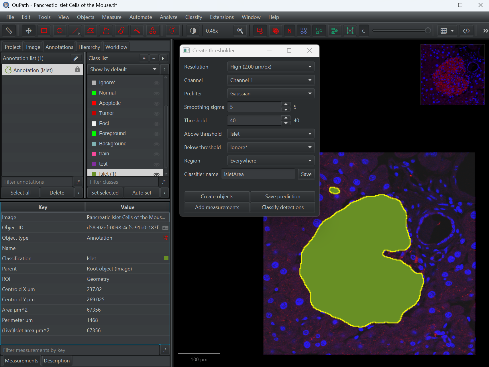

# Lesson Plan: Threshold Classification

**Before running this lesson, read `README.md` in this folder for the setup instructions.**

**Duration:** 15-20 Minutes
**Goal:** Teach how to segment objects based on pixel intensity using the "Create Thresholder" tool.

## Part 1: The Concept (5 Minutes)
*   **Question:** "How do we find the bright object in this dark image?"
*   **Concept:** Here the object is simply *brighter* than the background. We can use a simple cutoff value (Threshold) based on intensity, without needing complex machine learning.

## Part 2: The Setup (2 Minutes)
*   **Action:** Run `01_setup_threshold.groovy`.
*   **Explain:** "I've created a class called **Islet**. We want to find all pixels that belong to this class."
*   **QuPath classes:** Classes are named labels (with colors) that tell QuPath what each object represents—crucial for measurement tables, training classifiers, and keeping your hierarchy organized.
*   **Create classes by hand:** In the **Annotations** tab, look to the **Class list** panel (screenshot above). Press the `+` button to add a class. Give the class a name such as `Islet`, choose a color swatch, and click **OK**. Highlight the class in the list so it shows the eye icon, then draw annotations or select existing ones and press **Set selected** (or `Ctrl + K` / right-click ▸ **Set class**) to apply it. Use **Auto set** if you want each newly drawn object to inherit the currently highlighted class automatically.

## Part 3: Interactive Thresholding (10 Minutes)
*   **Step 1: Open the Tool**
    *   Go to `Classify > Pixel classification > Create thresholder`.
*   **Step 2: Adjust Parameters**
    *   **Resolution:** Controls the processing resolution. 'Extremely low' is fast for previewing, but you may want higher resolution for the final result.
    *   **Channel:** Select the channel containing the signal (e.g., Channel 1).
    *   **Prefilter & Smoothing:** Use 'Gaussian' and adjust 'Smoothing sigma' to reduce noise if needed.
    *   **Threshold:** Adjust the numeric value to define the cutoff. Pixels brighter than this value will be selected.
    *   **Above threshold:** Select the class to assign to bright pixels (e.g., **Islet**).
    *   **Region:** Set to 'Everywhere' to process the whole image.
* **Step 3: Save the Classifier (Optional)**
    * Enter a descriptive name in **Classifier name** (e.g., `Islet_Threshold_40`).
    * Click **Save** to store the current settings for reuse later in the session or for batch processing.
    * Mention that saved classifiers can be reloaded from the Pixel classifier list for quick demos.
* **Step 4: Decide what to do with the classified pixels**
    * **Create objects** — Converts the mask into editable vector regions (see the [Thresholding tutorial](https://qupath.readthedocs.io/en/stable/docs/tutorials/thresholding.html#thresholding-results)).
        * Click **Create objects**, choose **New object type = Annotation**.
        * Set **Minimum object size** (≈100 µm²) to remove speckles.
        * Enable **Delete existing objects** if you want to replace previous attempts.
        * Optionally tick **Split objects** if you want touching regions to be separated into individual annotations (useful when adjacent islets should be reported separately).
        * Press **OK** to add annotations with the chosen class/color for later editing.
    * **Add measurements** — Keeps the mask temporary but records statistics (see the [Measuring areas tutorial](https://qupath.readthedocs.io/en/stable/docs/tutorials/measuring_areas.html#measuring-area-using-a-thresholder)).
        * Click **Add measurements** to write thresholded area, % positive, and mean intensity to the Measurement table.
        * Works on the selected annotation or the whole image, depending on what is active.
        * Best when you only need numbers and do not wish to clutter the object hierarchy.

## Part 4: Getting The Result with a Script (3 Minutes)

* **Action:** Run `02_report_threshold.groovy`.
* **Outcome:** A popup box appears: *"Islet Area: X µm²"*.
* **Discussion:** Thresholding is fast and accurate for high-contrast fluorescence, but fails if the background is uneven or the object has complex texture.
