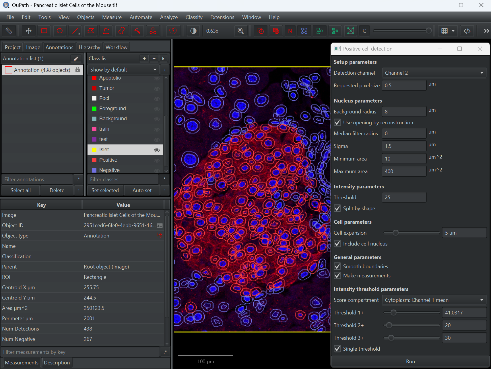

# Lesson Plan: Positive Cell Detection

**Before running this lesson, read `README.md` in this folder for the setup instructions.**

**Duration:** 15-20 Minutes
**Goal:** Teach how to detect cells and classify them as Positive/Negative based on intensity in a single step.

## Part 1: The Concept (5 Minutes)
*   **Scenario:** "We want to count how many cells in this image of the pancreas are producing insulin (Positive Red Signal)."

## Part 2: The Setup (2 Minutes)
*   **Action:** Run `01_setup_positive.groovy`.
*   **Explain:** "I've created our buckets: **Positive** (Red) and **Negative** (Blue)."

## Part 3: Running the Tool (10 Minutes)
*   **Step 1: Open the Tool**
    *   `Analyze > Cell detection > Positive cell detection`.
* **Step 2: Configure Detection**
    * **Detection channel:** Pick the fluorescence channel containing nuclei (Channel 2 in this dataset).
    * **Requested pixel size:** 0.5 µm keeps the detection smooth without being too slow.
    * **Background radius / Median filter / Sigma:** These smooth the image before nucleus finding. Use the screenshot values (8, 0, 1.5) and explain that larger radii remove more low-frequency background while sigma controls Gaussian blur.
    * **Minimum/Maximum area:** Filters detections outside 10–400 µm² so debris or merged clumps are ignored.
    * **Split by shape:** Leave checked so elongated clusters can be separated into individual cells.
* **Step 3: Tune Intensity & Cell Parameters**
    * **Threshold (Intensity parameters):** Defines which nuclei are initially accepted. Start around 25 for channel 2 and tweak while watching the preview.
    * **Cell expansion (Include cell nucleus):** Grows each detection by 5 µm into the cytoplasm so measurements see both nucleus and cytoplasm.
    * **Smooth boundaries** keeps the expanded cell outline clean; **Make measurements** ensures the statistics appear in the Measurement table.
    * **Score compartment:** Choose where the positivity is measured (e.g., `Cytoplasm: Channel 1 mean`).
    * **Threshold 1+/2+/3+:** These sliders define the intensity bins for the score compartment. With **Single threshold** enabled, only `Threshold 1+` is used and everything above it is marked **Positive**—perfect for a binary Positive/Negative lesson.
* **Step 4: Run**
    * Click **Run**.

## Part 4: The Result (3 Minutes)
*   **Action:** Run `02_report_positive.groovy`.
*   **Outcome:** A popup box appears: *"Positivity: 65.4%"*.
*   **Discussion:** This is the standard method for scoring biomarkers like Ki67, ER, PR, or Insulin where the difference is purely intensity-based.
