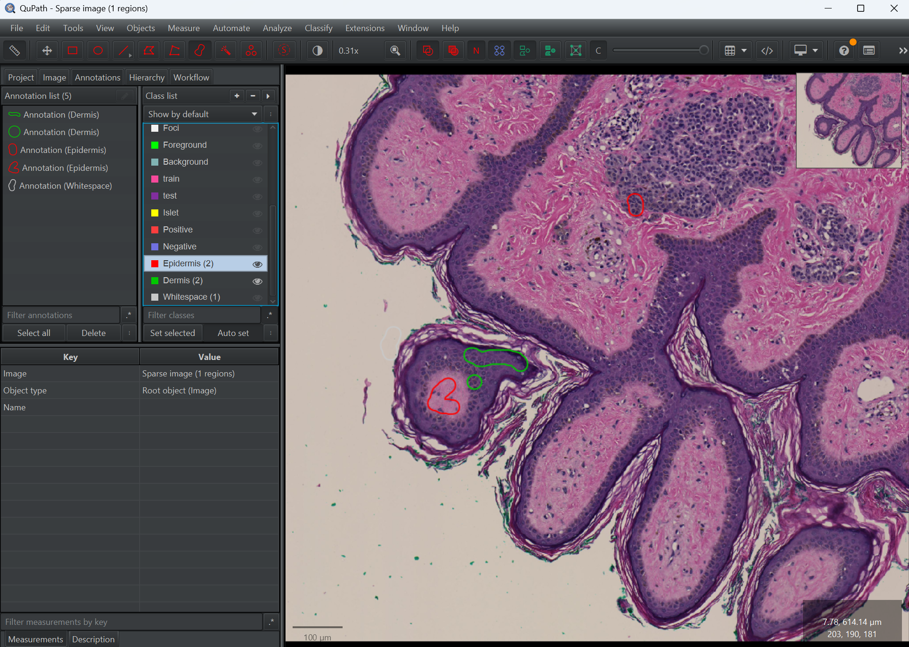
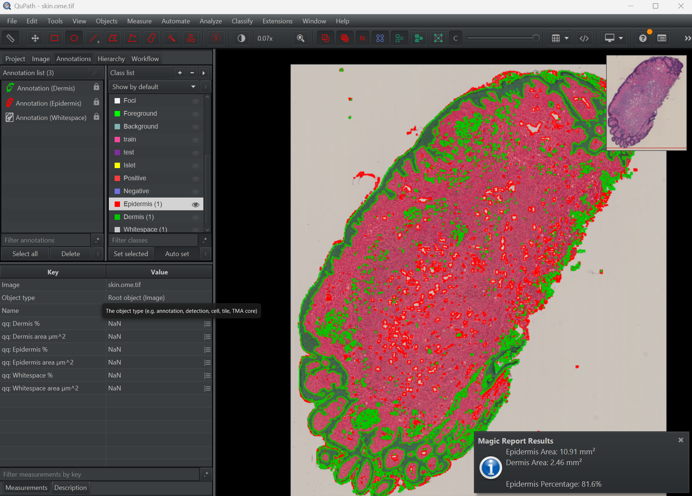

# Lesson Guide: Pixel Classification in QuPath

**Before you start, read `README.md` in this folder for the setup instructions.**

**Duration:** 30-60 Minutes
**Goal:** Experience "Training by Example" using the Random Trees pixel classifier.

## Part 1: The "Why" (5 Minutes)
*   **Guiding question:** Why can't we just select the purple stuff?
*   **Activity:**
    1.  Open `skin.ome.tif`.
    2.  Zoom into the dark purple edge (epidermis).
    3.  Describe the epidermis color (deep purple) and texture in your own words.
    4.  Move into the dermis and describe its pink tone and smoother texture.
    5.  **Takeaway:** Color alone is not enough. You need texture cues—the "robot eye"—to separate tissues reliably.

## Part 2: Create a Training Image (Optional but strongly recommended, 5 Minutes)
*   **Purpose:** Cropping a training-only composite gives you fast reload times and a tidy workspace while you practice.
*   **Steps:**
    1.  Use `Classify > Training images > Create region annotations` to drop square regions over representative epidermis, dermis, and whitespace patches (press **S** to save when finished).
    2.  Select `Classify > Training images > Create training image`, choose your classification (e.g., `Region*`), set a preferred width (around 50,000 px works well here), and click **OK** to generate the composite.
    3.  Open the new training image from the project list and continue annotating there—it behaves like a regular slide but loads almost instantly.
*   **Applied example:** Extract a strip containing epidermis, dermis, and blank background. Use this smaller slide for your practice run, then hop back to the original whole slide once you feel ready to analyze everything.

## Part 3: The Setup (2 Minutes)
*   **Run** the `assignment1_magic_setup.groovy` script.
*   **What this does:** It creates the layer classes you will train—Stratum corneum, EPTZ, Stratum granulosum, Stratum spinosum, Stratum basale, Dermis, plus Whitespace—each with a contrasting color so you can immediately start drawing examples for every compartment.

## Part 4: Interactive Training (15 Minutes)
*   **Step 1: Annotate**
    *   Toggle **Auto Set** on and work from the surface inward: **Stratum corneum → EPTZ → Stratum granulosum → Stratum spinosum → Stratum basale → Dermis**.
    *   Use the **Brush Tool** with small strokes and keep each layer on its own class to avoid cross-contamination.
    *   Finish with a quick pass on **Whitespace** for the empty glass background.
*   **Step 2: Train**
    *   Open `Classify > Pixel classification > Train pixel classifier` (see the [Pixel classification tutorial](https://qupath.readthedocs.io/en/stable/docs/tutorials/pixel_classification.html)).
    *   When the dialog appears:
        *   **Classifier:** Choose *Random trees (RTrees)*—it is fast, forgiving, and ideal for a first classifier.
        *   **Resolution:** Start at *Moderate* (3.65 µm/px). Lower values train faster with less detail; higher values capture more structure but add noise.
        *   **Features:** Leave *Default multiscale features 2D* enabled so the classifier can mix Gaussian blur, Laplacian, and structure tensor cues.
        *   **Output:** Stay with *Classification* to store the class probabilities per pixel. Remember that *Probability maps* can come later if you need heatmaps.
        *   **Region:** Keep *Everywhere* to learn from the whole slide, or switch to *Within annotations* when you want to restrict learning to a specific ROI.
        *   **Load training / Save / Classifier name:** Enter something descriptive (e.g., `Skin_RT_2025`). Save once you like the preview so you can reload it later.
    *   **Crucial step:** Click **Live prediction** so the viewer updates instantly each time you add or correct strokes.
*   **Step 3: Refine (Human-in-the-loop)**
    *   Watch for mistakes (for example, QuPath may think an ink mark is dermis).
    *   Select the correct class, paint over the error, and let Live prediction refresh.
    *   Continue looping between annotate → train → check until the overlay looks right.

## Part 5: Under the Hood (10 Minutes)
*   **Purpose:** See how parameter choices influence quality and speed.
*   **Try this:**
    *   Change **Resolution** to *Low*. Notice how the overlay gets blocky but refreshes quickly.
    *   Change **Resolution** to *High*. Notice the finer detail, extra noise, and slower refresh.
    *   Open **Select features…** in the training dialog and explore how the components work (see the [QuPath pixel-classification tutorial](https://qupath.readthedocs.io/en/stable/docs/tutorials/pixel_classification.html#select-features) for visuals):
        *   **Channels:** Choose which stains feed the classifier. Using all channels helps when texture differences hide in non-RGB spaces.
        *   **Scales:** Smaller scales (e.g., 0.5) emphasize fine detail, while larger scales (e.g., 2.0) smooth over noise to capture broad tissue trends.
        *   **Features:** Each feature type (Gaussian blur, Laplacian of Gaussian, structure tensor, etc.) highlights different patterns—edges, blobs, gradients—so the classifier sees more than raw intensity.
        *   **Local normalization:** Setting a radius (like 8 px) forces QuPath to compare each pixel to its neighborhood, which can tame illumination variation before features are computed.
    *   Toggle feature combinations and scales, retrain, and observe how the probability map shifts. This helps you build intuition for which settings capture epidermis vs dermis texture.

## Part 6: Apply to the Whole Slide (5 Minutes)
*   **Open** the original `skin.ome.tif` if you trained on a cropped image.
*   **Load** your saved classifier via `Classify > Pixel classification > Load pixel classifier` and select the file you saved earlier.
*   **Create objects:** Choose `Classify > Pixel classification > Create objects` and keep the default *Do not split* option so QuPath converts epidermis/dermis pixels into regions without fragmenting them.
*   **Inspect** the overlay, look at the different in size, and save the project so the classification sticks to the full-resolution slide.

## Part 7: The Result (5 Minutes)
*   **Save** the classifier ("SkinLayers_RT" works) so you can reuse it.
*   **Run** the `assignment1_magic_report.groovy` script.
*   **Read the popup:** QuPath summarizes each compartment (e.g., *"Stratum corneum: 0.12 mm² (6.3%)"*).
*   **Interpretation:** Layer percentages become reproducible biomarkers—far more objective than eyeballing "about 10%" of epidermis.

