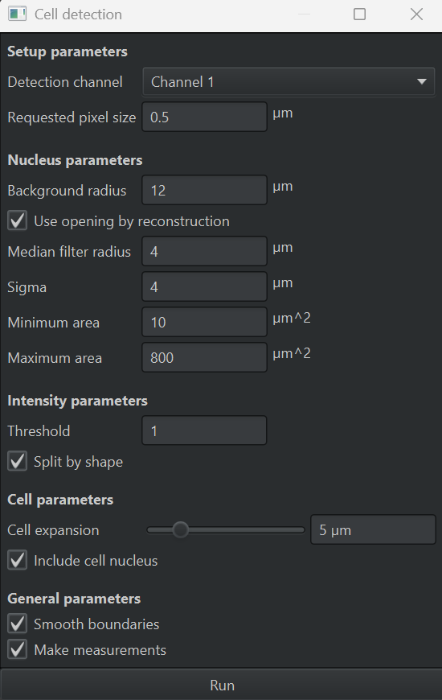
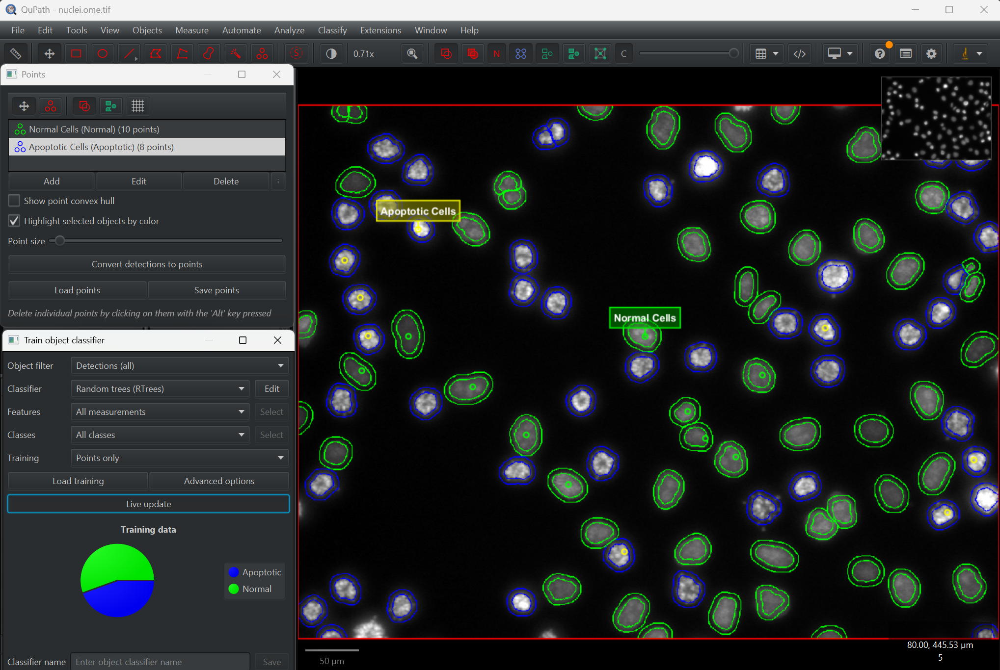
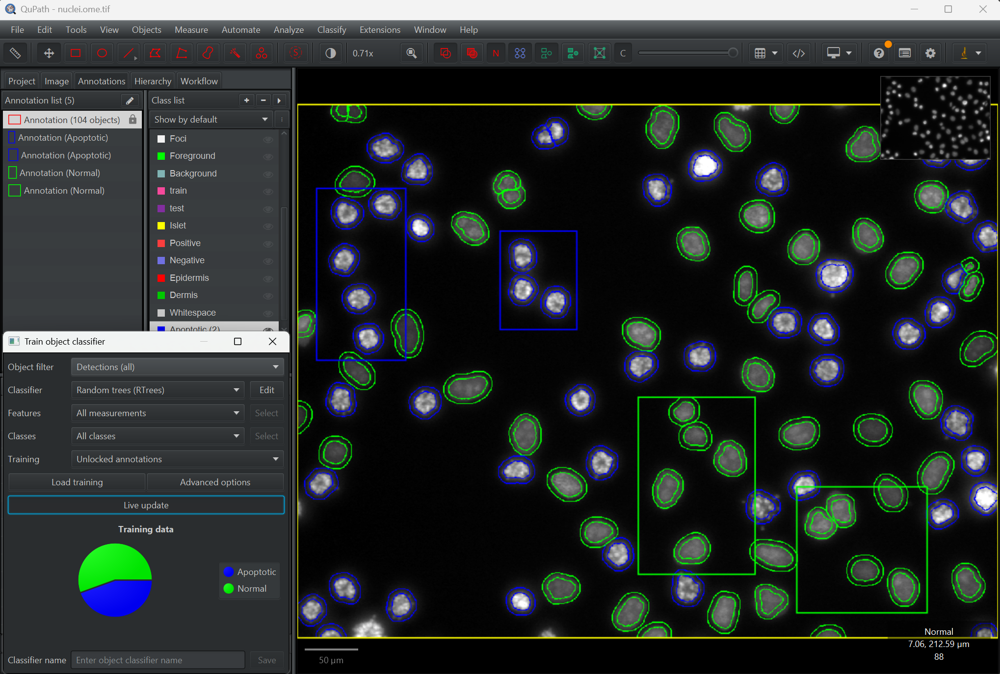

# Lesson Guide: Cell Classification (Normal vs Apoptotic)

**Before you start, read `README.md` in this folder for the setup instructions.**

**Duration:** 20-30 Minutes
**Goal:** Practice the workflow of Cell Detection → Feature Extraction → Object Classification.

## Part 1: The Concept (5 Minutes)
*   **Observe the slide:**
    *   **Normal nuclei** look dimmer, larger, and smooth/oval.
    *   **Apoptotic nuclei** glow brightly because the chromatin is condensed; they appear smaller or fragmented.
*   **Strategy:** Simple thresholding would lump cells together. Instead you will:
    1.  **Detect** every nucleus.
    2.  **Measure** intensity and shape features.
    3.  **Train** a classifier to separate the two phenotypes.

## Part 2: The Setup (2 Minutes)
*   **Run** `01_setup_cells.groovy`.
*   **What you get:** Two classes—**Normal** (blue) and **Apoptotic** (red)—so you can start labeling immediately.

## Part 3: Cell Detection (10 Minutes)
*   **Step 1: Run detection**
    *   Choose `Analyze > Cell detection > Cell detection`.
*   **Step 2: Tune parameters**
    *   **Detection image:** Select the DAPI channel.
    *   **Threshold:** Adjust until both dim and bright nuclei are detected.
    *   **Cell expansion:** Set to 5.
    *   Click **Run**.
*   **Outcome:** Yellow outlines should cover every nucleus. They start as "Unclassified" objects that you'll label next.
*   **Note on object type:** Cell Detection creates the special **Cell** object type—essentially a paired nucleus ROI with an optional expanded cytoplasm ROI—so QuPath can store both nuclear and cellular measurements together (see the [object types overview](https://qupath.readthedocs.io/en/stable/docs/concepts/objects.html#types-of-object)).

## Part 4: Training the Classifier (10 Minutes)
*   **Step 1: Pick your training style**
    *   **Points workflow (screenshot below):** Open the **Points** panel, click **Add** to create a point annotation group, then double-click its entry to set the name and class (matching the dialog shown above). With the group active, click inside nuclei to drop labeled points; Alt-click removes a point, drag to reposition.

<table style="margin:0 auto">
    <tr>
        <td style="padding:0 12px" align="center">
            
        </td>
        <td style="padding:0 12px" align="center">
            
        </td>
    </tr>
</table>

*   **Unlocked annotations workflow (screenshot below):** Draw rectangular annotations that enclose good examples, keep them unlocked, and set their classes in the **Annotations** pane. All detections inside the annotation inherit that class for training, which speeds up labeling dense regions.
   

*   **Step 2: Gather examples**
    *   In either workflow, make sure both **Normal** and **Apoptotic** cells are represented (≈5–10 of each). Use `Set class` or the **Set selected** button to toggle classes quickly.
*   **Step 3: Train**
    *   Open `Classify > Object classification > Train object classifier`.
    *   **Classifier:** Keep Random Trees.
    *   **Features:** Rather than relying only on `Nucleus: Mean`, toggle on shape and texture metrics that stay stable across microscopes—`Nucleus: Area`, `Nucleus: Circularity`, `Nucleus: Eccentricity`, plus `Nucleus: Std. dev.` for intensity variation. Let students experiment with which combination separates the phenotypes best.
    *   Set **Training** to `Points only` or `Unlocked annotations` to match your labeling style, then click **Live update** for instant feedback.
*   **Step 4: Refine**
    *   Continue correcting mistakes by adding more points/annotations as needed and keep Live update running.

## Part 5: The Result (5 Minutes)
*   **Save** the classifier ("Apoptosis Finder" is a good name) so you can reuse it later.
*   **Run** `02_report_cells.groovy`.
*   **Read the popup:** QuPath reports something like *"Apoptotic Index: 12.5%"*—a reproducible biomarker instead of a guess.
