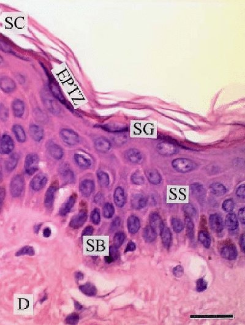

# Day 2 Assignments: Machine Learning Classification

These exercises reinforce the Pixel Classification and Cell Classification lessons. Encourage students to save their QuPath projects before starting.

## Assignment 1 – Stratified Skin Pixel Classification

<em>H&E staining of human skin. This photograph of H&E-stained tissue reveals the epidermis and partial dermis. All cellular components can be visualized with the H&E stain: stratum corneum (SC); the epidermal phase transition zone (EPTZ) (~42 µm); stratum granulosum (SG); stratum spinosum (SS); stratum basale (SB); and the dermis (D). No nuclear staining occurs in the denucleated cells of the SC. Scale bar 30 µm.</em>

1. Open `resources/skin.ome.tif` and run `assignment1_magic_setup.groovy` if needed.
2. Use the **Pixel classifier** tool to label all six epidermal/dermal compartments created by the setup script: **Stratum corneum, EPTZ, Stratum granulosum, Stratum spinosum, Stratum basale, Dermis** (keep **Whitespace** for glass/background).
3. Train on a small training imag until **Live prediction** shows clean separation of each layer; refine strokes where the classifier confuses adjacent strata.
4. Save the classifier and record how it performs on the full image.
5. **Deliverable:** Screenshot of the multi-class overlay and a short note on which layers were hardest to separate (and why).

## Assignment 2 – Feature Engineering Challenge
1. Reopen the same slide and switch to the **Feature selection** tab inside the pixel classifier.
2. Try disabling one feature group at a time (color, texture, etc.) and document how the classification changes.
3. Identify a minimal feature set that still separates the classes, and justify your choice in two sentences.

## Assignment 3 – Cell Phenotype Quantification
1. Move to `Day2/2) cell_classification` and run `01_setup_cells.groovy` if the classes are missing.
2. Detect cells, then choose either the **Points** or **Unlocked annotations** workflow to label at least 15 Normal and 15 Apoptotic nuclei.
3. Train the classifier with shape-heavy features (area, circularity, eccentricity) and record the confusion you see when misclassifications occur.
4. Run `02_report_cells.groovy` and report the Apoptotic Index for at least two fields of view.

## Assignment 4 – Batch Classifier Test (Optional)
1. Save your cell classifier and apply it to a second slide or a different region of the same slide.
2. Compare the resulting measurements to your manual estimates. Note any drift and hypothesize what additional training data or features might reduce it.

---
**Tip:** Encourage students to keep the *Workflow* tab open so they can copy the scripts QuPath auto-generates for any processing steps they run manually.