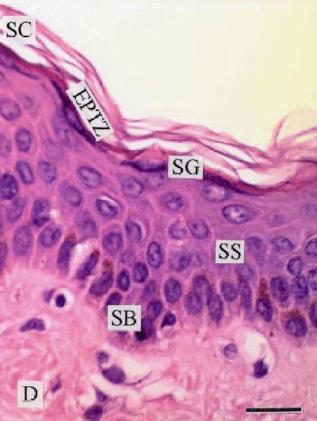
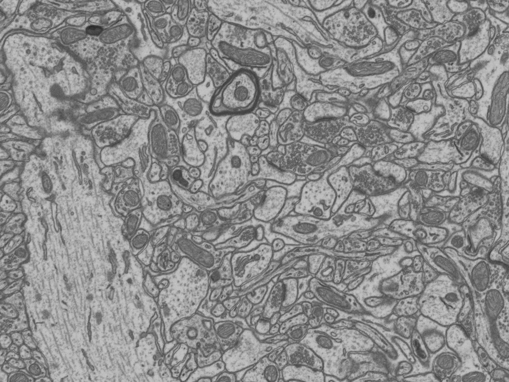

# Day 2 Assignments: Machine Learning Classification

These exercises reinforce the Pixel Classification and Cell Classification lessons. Encourage students to save their QuPath projects before starting.

## Assignment 1 – Stratified Skin Pixel Classification
1. Open `resources/skin.ome.tif` and run `scripts/assignment1_magic_setup.groovy` if needed.
2. Use the **Pixel classifier** tool to label all six epidermal/dermal compartments created by the setup script: **Stratum corneum, EPTZ, Stratum granulosum, Stratum spinosum, Stratum basale, Dermis** (keep **Whitespace** for glass/background).
3. Train on a small training image until **Live prediction** shows clean separation of each layer; refine strokes where the classifier confuses adjacent strata.
4. Save the classifier and record how it performs on the full image.
5. Run `scripts/assignment1_magic_report.groovy` after clicking **Create objects** to capture the area/percent contribution of each stratum; use it whenever you compare different fields of view.
6. **Deliverable:** Screenshot of the multi-class overlay, the text output from `assignment1_magic_report.groovy`, and a short note on which layers were hardest to separate (and why).

<em>H&E staining of human skin reveals the epidermis and partial dermis. All cellular components can be visualized with the H&E stain: stratum corneum (SC); the epidermal phase transition zone (EPTZ) (~42 µm); stratum granulosum (SG); stratum spinosum (SS); stratum basale (SB); and the dermis (D). Scale bar 30 µm.</em>

## Assignment 2 – EM Organelle Pixel Classification
1. Open `resources/Cell(EM).ome.tif` – an electron microscopy image showing detailed subcellular ultrastructure.
2. Use the **Pixel classifier** to segment different cellular compartments based on their texture and intensity patterns.
3. Create classes for the main structures visible: **Mitochondria** (dark oval structures with internal cristae), **Cytoplasm**, **Vesicles**, and **Membrane** (or choose your own relevant structures).
4. Train the classifier using texture features—EM images are ideal for texture-based classification due to their rich structural detail.
5. Click **Create objects** and measure the area fraction of each compartment.
6. **Deliverable:** Screenshot of the pixel classifier overlay, a table showing the area/percentage of each segmented structure, and a short note on which structures were easiest vs. hardest to classify.

<em>Electron microscopy (EM) image showing detailed cellular ultrastructure including mitochondria, cytoplasm, vesicles, and membrane structures.</em>

## Assignment 3 – Dividing Cell Identification in `CellsNuclei.ome.tif`
1. Open `resources/CellsNuclei.ome.tif` (red nuclei, green membranes similar to the preview image) and run `scripts/assignment3_magic_setup.groovy` to load the **Dividing** and **Non-dividing** classes.
2. Run `Analyze > Cell detection > Cell detection` 
3. Label at least 15 examples of each class using either the **Points** or **Unlocked annotations** workflow, then train an **Object classifier** (Random Trees) emphasizing membrane intensity features (e.g., `Cell: Mean`, `Cell: Std dev`, `Nucleus: Mean`). Keep Live update enabled and refine mislabeled cells.
4. Click **Create objects** if needed, then execute `scripts/assignment3_magic_report.groovy` to record the total number and percentage of Dividing vs Non-dividing cells.
5. Compare the classifier’s readout to a **Positive cell detection** or **Single measurement classifier** workflow from Day 1 (reuse the scripts from `Day1/4) positive_cell_detection`). Document how the automated thresholds differ from your trained classifier.
6. **Deliverable:** Screenshot of the classifier overlay, the text output from `assignment3_magic_report.groovy`, and a short paragraph summarizing the % dividing cells from both methods and explaining any discrepancies.

## Bonus Assignment – Your Own Day 2 Experiment
* **Image:** Pick any image from the main `resources/` folder.
* **Objective:** Design a mini-analysis that combines at least one of the two Day 2 tools (pixel classifier, cell detection + object classifier, feature selection, measurement export, etc.). Decide on a machine-learning-friendly biological question (layer proportions, phenotype ratios, intensity comparisons).
	1. Briefly describe why you selected the image and what you plan to measure.
	2. Run the necessary Day 2 steps (e.g., create training annotations, train/validate a classifier, generate measurements, export reports).
	3. Summarize the result in a short paragraph plus a screenshot or chart.
* **Deliverable:** Turn in a one-slide summary or short paragraph detailing the question, the Day 2 tools you used, key parameter values (resolution, feature set, classifier type), and the final measurement. Include at least one screenshot showing the classifier or report in action.

> **Tip:** Treat this as a self-guided experiment. Pixel classification, object classification, feature engineering, and reporting scripts to answer a question that would be tedious with manual tools alone.

