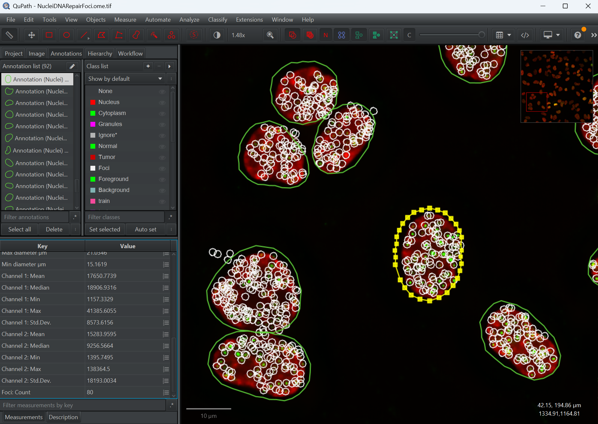

# Lesson: Spot Detection with Spotiflow

**Before running this lesson, read `README.md` in this folder for the setup instructions.**

**Duration:** 30 Minutes
**Goal:** Detect DNA repair foci within nuclei using a pre-trained deep learning spot detector.

## Part 1: The Context (5 Minutes)
*   **Image:** `NucleiDNARepairFoci.ome.tif`.
    *   **Red Channel (DAPI):** Nuclei.
    *   **Green Channel (GFP):** DNA Repair Foci (Spots).
*   **Goal:** Count the number of spots *per nucleus*.

## Part 2: Parent Detection with StarDist (5 Minutes)
*   **Concept:** To count "spots per cell", we first need to detect the cells (nuclei).
*   **Action:** Run `01_detect_nuclei.groovy`.
*   **Parameters:**
    *   **Channel:** Select the DAPI/nucleus channel.
    *   **Downscale:** Resolution factor (1 = full resolution).
    *   **Probability Threshold:** Detection confidence (0.5 is a good default).
    *   **Mean/Gaussian filter:** Optional preprocessing for noisy images.
    *   **Exclude on borders:** Remove nuclei touching image edges.
*   **Result:** Yellow annotation outlines around the red nuclei.

## Part 3: Spotiflow Foci Detection (10 Minutes)
*   **Concept:** Spotiflow is a deep learning model trained specifically for spot detection. It is more robust to noise than standard "Fast Peak Search" methods.
*   **Action:** Run `02_spotiflow_foci.groovy`.
*   **Parameters:**
    *   **Foci channel:** Select the GFP/green channel containing the spots.
    *   **Foci class name:** Classification label for detected foci (default: "Foci").
    *   **Spotiflow device:** Computation device (`auto`, `cuda`, `cpu`, `mps`).
    *   **Pretrained model:** Choose from available models:
        *   `general` - General purpose spot detection (recommended default).
        *   `hybiss` - Optimized for HybISS data.
        *   `synth_complex` - Trained on complex synthetic data.
        *   `fluo_live` - For live-cell fluorescence imaging.
        *   `synth_3d` / `smfish_3d` - For 3D spot detection.
    *   **Probability threshold:** Leave blank for model defaults, or set a value (0-1) to filter weak detections.
    *   **Peak detection mode:** `fast` (recommended) or `skimage` (more precise but slower).
*   **Result:** Point detections are created for each detected focus.
*   **Important:** The detected foci are created as **point annotations** which are very small. **You need to zoom in closely on individual cells to see them** in the QuPath viewer. At low zoom levels, the points may not be visible!
*   **Tip:** Use `View > Show detection objects` to toggle visibility, and zoom in to at least 400% to clearly see individual foci points.
*   **Analysis:** Look at the measurement table. Each Nucleus now has a "Foci: Count" measurement.

## Part 4: Combined Workflow (10 Minutes)
*   **Concept:** For convenience, you can run both StarDist nuclei detection and Spotiflow foci detection in a single script with one unified parameter dialog.
*   **Action:** Run `03_stardist_spotiflow_combined.groovy`.
*   **Advantage:** 
    *   Single dialog with all parameters for both methods.
    *   Automatically handles the full workflow: detect nuclei → detect foci → count foci per nucleus.
    *   No need to select parent objects first - the script creates a full-image annotation if nothing is selected.
*   **Parameters:** Combines all parameters from scripts 01 and 02:
    *   **StarDist section:** Nucleus channel, downscale, threshold, filters, border exclusion.
    *   **Spotiflow section:** Foci channel, class name, device, model, probability threshold, peak mode.
*   **Result:** 
    *   Nucleus annotations with shape and intensity measurements.
    *   Foci point detections as children of each nucleus.
    *   "Foci: Count (nucleus)" measurement added to each nucleus annotation.
*   **Visualization Note:** Remember that foci are point annotations - **zoom in on a few cells** to see them! At overview zoom levels, the tiny points are not rendered by QuPath.

## Part 5: Histogram Report (5 Minutes)
*   **Concept:** Visualize the distribution of foci counts across all nuclei to understand the population statistics.
*   **Action:** Run `04_report_foci_histogram.groovy`.
*   **Output:**
    *   A **histogram chart** showing how many nuclei have 0, 1, 2, 3... foci.
    *   **Summary statistics:** Mean, median, min, max, and standard deviation of foci per nucleus.
    *   Results are printed to the log and displayed in a popup chart window.
*   **Interpretation:**
    *   A peak at low foci counts indicates most cells have few DNA damage sites.
    *   A wide distribution or high mean suggests increased DNA damage across the population.
    *   Compare histograms between control and treated samples to assess treatment effects.
