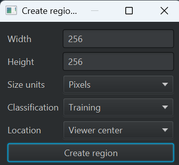

# Lesson: Training a Custom Cellpose Model on Phase Contrast Images Objects

**Before running this lesson, read `README.md` in this folder for the setup instructions.**

**Duration:** 45-60 Minutes
**Goal:** Go from raw images to a custom-trained Deep Learning model.

## Part 1: Project Setup & Image Calibration (5 Minutes)
*   **Create a New Project:**
    1.  In QuPath, go to `File > Project > Create project`.
    2.  Choose or create a new empty folder for this lesson.
    3.  Click `Create`.
*   **Add Images to Project:**
    1.  Go to `File > Project > Add images`.
    2.  Navigate to `resources/PhaseContrast/` folder.
    3.  Select all 30 JPG images and add them to the project.
*   **The Problem:** The phase contrast JPG images have no embedded pixel size calibration.
*   **Action:** Run `01_calibrate_images.groovy`.
*   **Parameters:**
    *   **Pixel size:** Enter the pixel size in µm/pixel (default: 0.2 µm/pixel).
*   **Result:** All 30 images in the project will be calibrated with the specified pixel size.
*   **Note:** You may need to close and reopen images to see the updated calibration in the viewer.

## Part 2: The Challenge (5 Minutes)
*   **Activity:** Open `01.jpg` (Phase Contrast).
*   **Try Cellpose:** Run `02a_test_cellpose.groovy` with a pre-trained model (e.g., `cyto3, nucleitorch_0`).
*   **Try StarDist:** Run `02b_test_stardist.groovy` with the default StarDist model.
*   **Observation:** Both models likely fail or produce poor results because they weren't trained on this specific type of phase contrast data.
*   **The Problem:** Pre-trained deep learning models work best on data similar to their training set. Phase contrast microscopy has unique optical properties that confuse models trained on fluorescence or brightfield images.
*   **Solution:** Train a custom model on your specific data!

## Part 3: Creating Ground Truth (20 Minutes)

> **📖 Reference:** For more details on training custom Cellpose models, see the [BIOP Cellpose Extension documentation](https://github.com/BIOP/qupath-extension-cellpose?tab=readme-ov-file#training-custom-models).

*   **Goal:** Create a high-quality dataset with separate Training and Validation sets.
*   **The Concept:**
    *   **Training Regions:** The model uses these to learn.
    *   **Validation Regions:** The model uses these to test itself during training (preventing overfitting).

> ⚠️ **IMPORTANT: Dense Annotations Required!**
> Training requires **dense annotations**. This means you cannot just annotate a few objects per Training and Validation rectangle. You **MUST** annotate **ALL** relevant objects within each of those regions! Missing objects will be learned as "background", confusing the model.

*   **Requirements:**
    *   **Training Regions:** Create at least **16** rectangles.
    *   **Validation Regions:** Create at least **6** rectangles.
    *   **Consistent Size:** All training/validation regions should be the **same size** (e.g., 256×256 pixels).
    *   **Distribution:** Spread these across the series of images (e.g., `01.jpg` to `20.jpg`). Don't put them all on one image.

  

*   **Action:**
    1.  **Define Classes:** Run `03_setup_classes.groovy` to add the **Training** and **Validation** classes.
    2.  **Create Region:** Go to `Classify > Training images > Create region annotations`.
        *   Set **Width** and **Height** to the same value (e.g., `256` pixels).
        *   Set **Size units** to `Pixels`.
        *   Set **Classification** to `Training` or `Validation`.
        *   Set **Location** to `Viewer center` to place the region at your current view.
        *   Click **Create region** to add the annotation.
        
        > 💡 **Tip:** Using the "Create region annotations" dialog ensures all your training regions are exactly the same size, which helps with consistent training.
        
    3.  **Annotate Objects:**
        *   Objects can be Nuclei or Nucleoli (not both, choose one)
        *   **Crucial:** Inside this rectangle, you **MUST** annotate **EVERY** single object.
        *   Use the **Wand** or **Brush** tool.
        *   If you miss a object inside the rectangle, the AI will learn that "this object is background" (False Negative), which confuses the model.
    4.  **Repeat:** Move to a new area or image and repeat until you have **16 Training** and **6 Validation** rectangles total.

## Part 4: Training (15 Minutes)
*   **Action:** Run `04_train_cellpose.groovy`.
*   **Important Parameters:**
    *   **Base model:** Select `None (train from scratch)` since no pretrained model fits this data.
    *   **Epochs:** Set to at least **75** when training from scratch (more epochs = longer training but better results). (75 Epochs can take 20 minutes or more on a CPU)
    *   **Diameter:** Set the average diameter of your objects in µm. Measure a few typical objects to estimate this value.
    
    > 💡 **Tip:** You can measure object diameter using `Measure > Show measurement tools` or by drawing a line annotation across a typical object.
    
*   **What happens:**
    *   QuPath exports your images and annotations.
    *   Cellpose trains a new model to minimize the error between its guess and your drawing.
    *   The model file is saved in the project folder.

## Part 5: Inference (10 Minutes)
*   **Action:** Open `04.jpg` (an image the AI hasn't seen).
*   **Action:** Run `05_run_custom_cellpose_model.groovy`.
*   **Result:** The model should now detect the phase contrast objects much better than any pretrained model.
